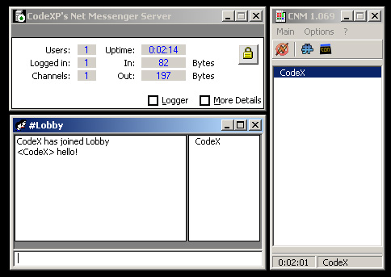



## a \[CNM1\] \- CodeXP's Network Messenger

### Description

Net Messenger - Network (LAN) and Internet Messenger 

For instant Text based Communications 

Server & Client Applications as SourceCode 

using TCP/IP Protocol) 

Features: 

- Multiuser (Max. Default 256 Users) 

- Private Message (User to User) 

- Channels (User to Group) 

- and other ... 
 
### More Info
 
It's very easy to use even for beginners!

And it's written partly in german. ;)

This Project is in development Phase, so

I will continue to code it.

             |
---                |---
**Submitted On**   |2003-08-09 15:39:30
**By**             |[CodeXP](https://github.com/Planet-Source-Code/PSCIndex/blob/master/ByAuthor/codexp.md)
**Level**          |Advanced
**User Rating**    |4.4 (40 globes from 9 users)
**Compatibility**  |VB 5\.0, VB 6\.0
**Category**       |[Complete Applications](https://github.com/Planet-Source-Code/PSCIndex/blob/master/ByCategory/complete-applications__1-27.md)
**World**          |[Visual Basic](https://github.com/Planet-Source-Code/PSCIndex/blob/master/ByWorld/visual-basic.md)
**Archive File**   |[a\_\[CNM1\]\_\-1631288172003\.zip](https://github.com/Planet-Source-Code/codexp-a-cnm1-codexp-s-network-messenger__1-46461/archive/master.zip)

